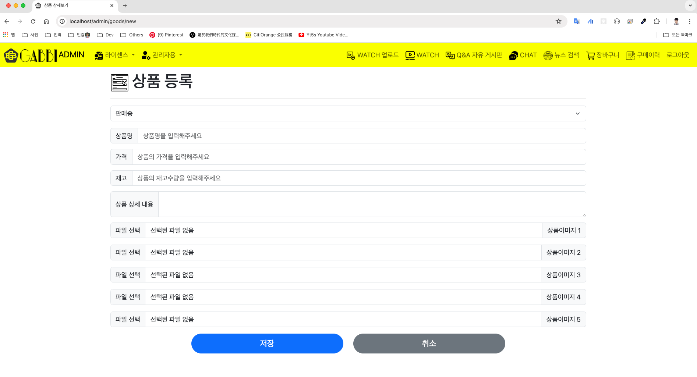

# Gabbi Project
## Start date: `2024.6.24`
## Author: `Sung-Hyuk Lee`
## Visible: `Confidential`
## Description: `This is gradution project aka. 'Capstone Design' of University.`
### Tech Skill
#### Java(JDK 21), Spring Boot(3.3), Thymeleaf, QueryDSL, MySQL9.0 Innovation, Spring Security 6, Spring WebSocket, JavaScript(ES6+), Java(Jakarta) Persistence API(JPA), RESTFul API, jQuery(부분적으로 사용함)
## Feature: `아이디로 관리자와 사용자를 자동으로 구분하고 해당 페이지에 로그인함, JPA(Jakarta Persistence API)사용한 장점은 Sql query문 따로 작성 할 필요 없어서 개발자 입장에서 편리함. 개발자는 그냥 코드 로직과 필요한 query문 QueryDSL의 annotation을 통해 DB접근 가능. 올리고 싶은 동영상을 마음대로 올릴 수 있음. 게시판 마음대로 작성할 수 있음.`
## 작동방법: Spring Boot Starter를 클릭하면 바로 실행 가능 따로 SQL 테이블을 생성할 필요 없음, 전제 조건은 로컬에 MySQL 설치되어 있고, 해당 DB(gabbi)이 있어야 함.
## 실행 화면:
###### 초기화면:

###### 로그인 화면:

###### 사용자 회원 가입 화면:

###### (관리자 로그인 상태에서 관리자 회원 가입 권한 있음)관리자 회원 가입 화면:

###### (로그인 상태 가능)관리자의 동영상 페이지:

###### 관리자 로그인 후 초기화면

###### 사용자 로그인 후 초기화면

###### 사용자의 동영상 페이지:

###### 사용자의 동영상 검색 기능:

###### 사용자의 동영상 시청기능:

##### 사용자 동영상 댓글 답글 기능:

##### 사용자 동영상 업로드 기능:

##### 사용자 게시판 기능:

##### 사용자 게시판 작성 기능:

##### 사용자 게시판 글 수정 기능:

##### 사용자 게시판 글 댓글 답글 기능:

##### 사용자 채팅방 초기 화면:

##### 사용자 채팅 화면:

##### 사용자 뉴스 검색 기능:

##### 사용자 뉴스 검색 초기화면:

##### 사용자 상품 구매 화면:

##### 사용자 주문 성공 알림:

##### 사용자 장바구니 담기 성공 알림:

##### 사용자 장바구니 화면:

##### 사용자 주문이력 화면:

##### 관리자 상품 등록 화면:

##### 관리자 상품 관리 화면:

##### 관리자 WATCH 시청자 수 통계 화면:

##### (자동 반전)관리자 가입자 수 통계 화면:

